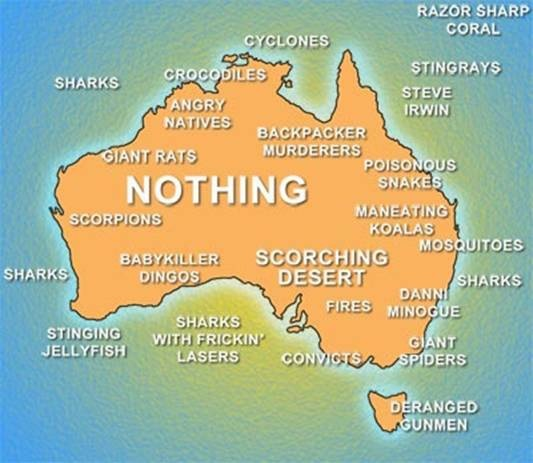
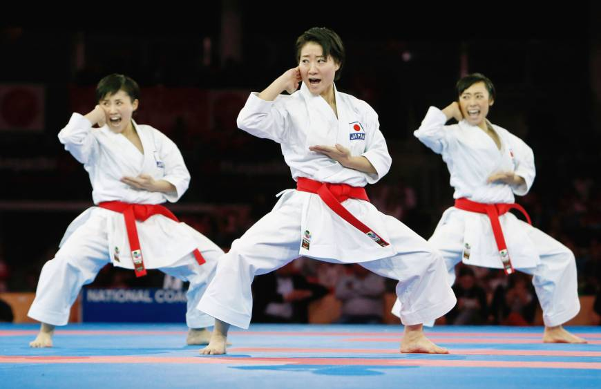
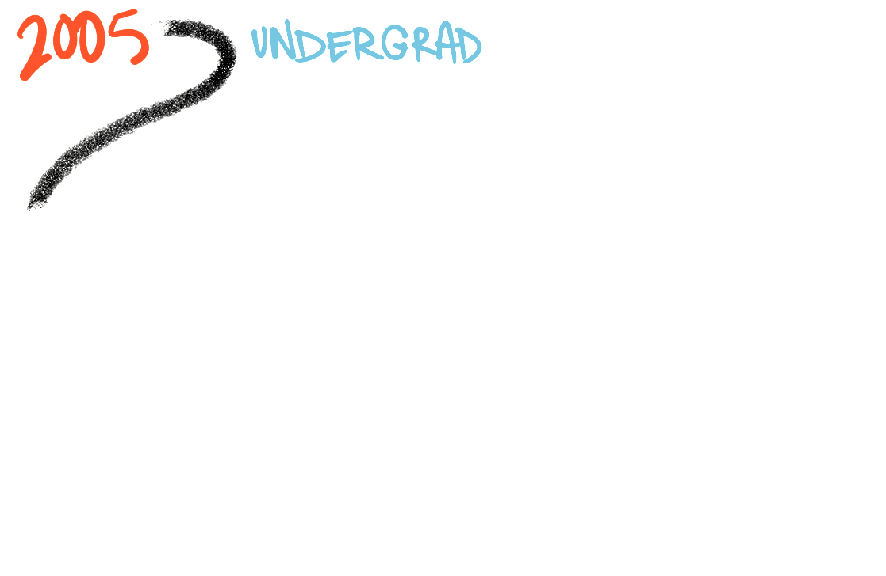
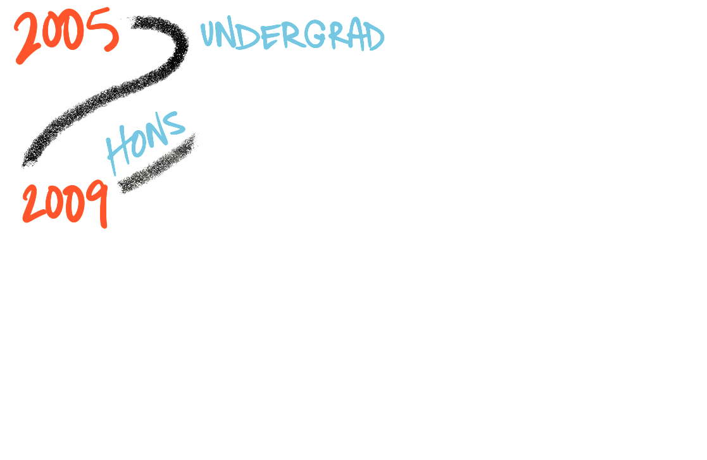
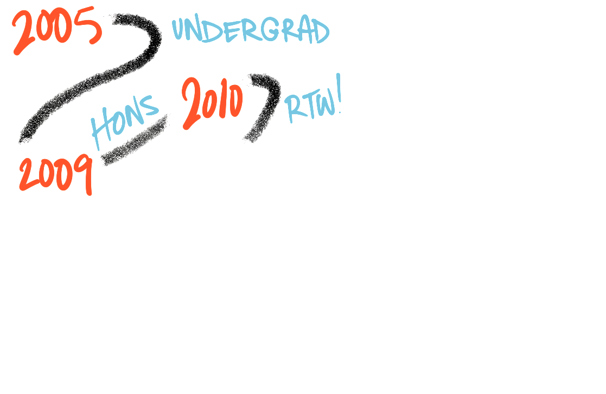
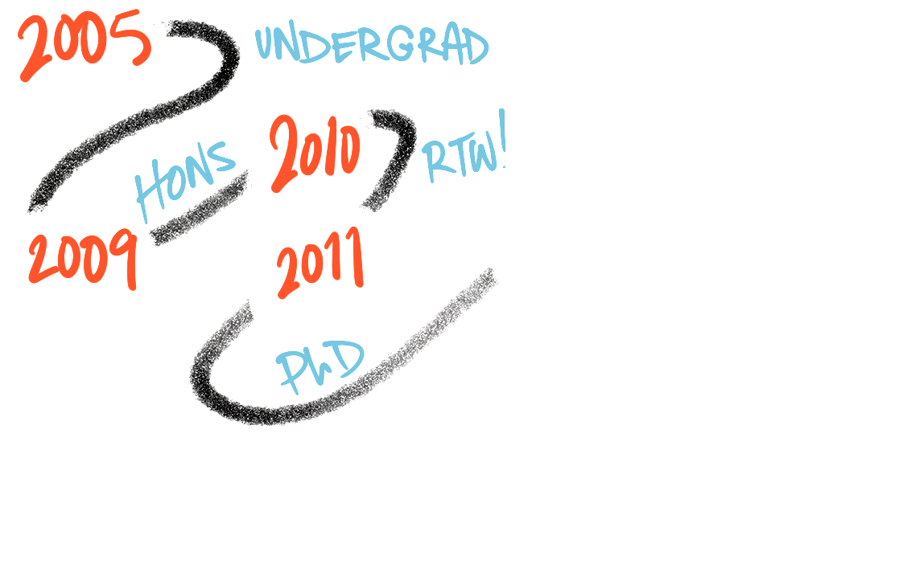
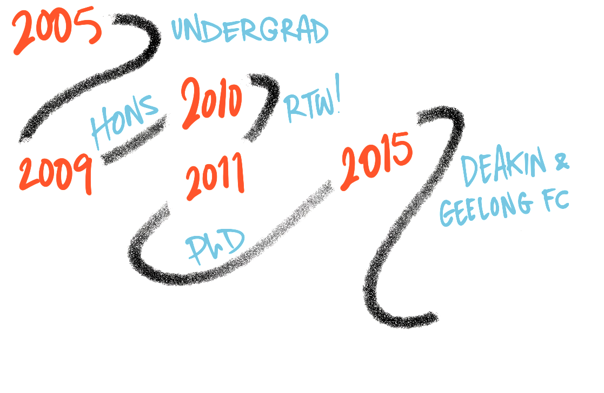
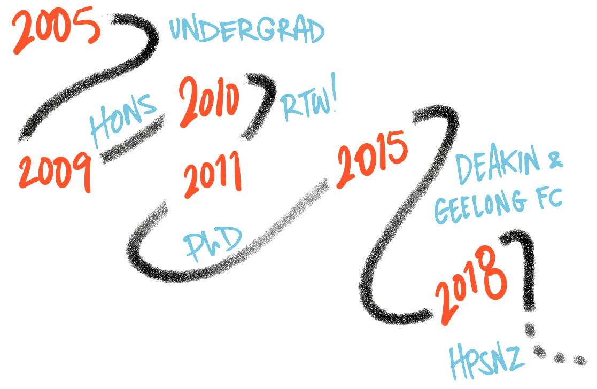

class: center, middle

```{r setup, include = FALSE}

options(htmltools.dir.version = FALSE)

```

# Who am I?

---
class: center, middle

``` {r introImage1, echo = FALSE}

# Australia


```

---
class: center, middle

``` {r introImage2, echo = FALSE}

# Melbourne


```

---
class: center, middle

``` {r introImage3, echo = FALSE}

# Torquay


```

---
class: center, middle

``` {r introImage4, out.width = "600px", echo = FALSE}

# Basketball
knitr::include_graphics("images/ball.jpg")

```

---
class: center, middle

``` {r introImage5, out.width = "600px", echo = FALSE}

# Karate


```

---
class: center, middle, inverse

# The long and winding road...

---
class: center, middle

``` {r careerPathImage1, out.width = "800px", echo = FALSE}



```

---
class: center, middle

``` {r careerPathImage2, out.width = "800px", echo = FALSE}



```

---
class: center, middle

``` {r careerPathImage3, out.width = "800px", echo = FALSE}



```

---
class: center, middle

``` {r careerPathImage4, out.width = "800px", echo = FALSE}



```

---
class: center, middle

``` {r careerPathImage5, out.width = "800px", echo = FALSE}



```

---
class: center, middle

``` {r careerPathImage6, out.width = "800px", echo = FALSE}



```

---
class: center, middle, inverse

# Visualisation principles

---
class: center, middle, inverse

# Visualising sport data
Worked examples

---
class: center, middle

``` {r thanksImage, out.width = "800px", echo = FALSE}

knitr::include_graphics("images/.png")

```

[https://github.com/jacquietran/aut-postgrads-2018-04](https://github.com/jacquietran/aut-postgrads-2018-04)

*****

Dr Jacquie Tran | @jacquietran | [https://www.jacquietran.com](https://www.jacquietran.com)

---
class: center, middle, inverse

# Looking for more?
Here are some resources I've found helpful and informative...

---

## Books

Claus O. Wilke, ['Fundamentals of Data Visualization'](http://serialmentor.com/dataviz/)

Alberto Cairo, ['The Functional Art'](http://www.thefunctionalart.com/p/about-book.html)

[Edward Tufte:](https://www.edwardtufte.com/tufte/books_vdqi)

- 'Visual Explanations'
- 'Beautiful Evidence'
- 'Envisioning Information'
- 'The Visual Display of Quantitative Information'

Dr Stephanie Evergreen, ['Effective Data Visualisation'](http://stephanieevergreen.com/books/)

Andy Kirk, ['Data Visualisation: A Handbook for Data Driven Design](http://www.visualisingdata.com/book/)

---

## Blogs and blog posts

Elijah Meeks, ['Gestalt principles for data visualisation'](https://medium.com/@Elijah_Meeks/gestalt-principles-for-data-visualization-59f18f20bd40)

Susie Lu, ['Storytelling in dashboards'](http://susielu.com/data-viz/storytelling-in-dashboards)

Dr Stephanie Evergreen, ['What #TLDR Means for your report'](http://stephanieevergreen.com/tldr/)

Dr Stephanie Evergreen, ['How to build data visualisations in Excel'](http://stephanieevergreen.com/how-to/)

Stuart Lee & Prof Di Cook (*Visiphilia* blog), ['Rookie mistakes and how to fix them when making plots of data'](http://www.dicook.org/2018/04/14/content/post/2018-04-14-rookie-mistakes/)

Cole Nussbaumer Knaflic, [*Storytelling With Data* blog](http://www.storytellingwithdata.com/)

---

## Tools, resources, and guides

[Cookbook for R - Graphs](http://www.cookbook-r.com/Graphs/)

Elijah Meeks & Susie Lu, ['Viz palette'](http://projects.susielu.com/viz-palette): Interactive tool for selecting colour-blind-friendly palettes

Dr Stephanie Evergreen, ['Data visualization checklist'](https://datavizchecklist.stephanieevergreen.com/rate/)

Jennifer Lyons, ['Qualitative chart chooser'](http://stephanieevergreen.com/qualitative-chart-chooser/)

---

## Podcasts, videos, and online courses

[Data Stories podcast](http://datastori.es/), with Enrico Bertini and Moritz Stefaner

Hans Rosling, ['The best stats you've ever seen'](https://www.ted.com/talks/hans_rosling_shows_the_best_stats_you_ve_ever_seen) (TED2006)

David McCandless, ['The beauty of data visualisation'](https://www.ted.com/talks/david_mccandless_the_beauty_of_data_visualization) (TEDGlobal 2010)

Dr Stephanie Evergreen & Andy Kirk for SAGE, ['Learn the essentials of data visualization'](https://www.youtube.com/watch?v=x7ICgz7NuCY)

---

## Visualisations using sports data

Prof Di Cook (*Visiphilia* blog), ['Better cricket plots'](http://www.dicook.org/2015/12/26/content/post/2015-12-26-rogers/)

Todd W. Schneider, ['BallR: Interactive NBA shot charts with R and Shiny'](http://toddwschneider.com/posts/ballr-interactive-nba-shot-charts-with-r-and-shiny/)

Joe Fox, Ryan Menzies, and Armand Emamdjomeh for the LA Times, ['Every shot Kobe Bryant ever took. All 30,699 of them'](http://graphics.latimes.com/kobe-every-shot-ever/)

Stephanie Kovalchik (*Stats On The T* blog), ['Measuring match fatigue'](http://on-the-t.com/2017/10/13/fatigue-effects/)

---

## Programming (R, CSS)

[xaringan demo presentation](https://slides.yihui.name/xaringan/)

[xaringan wiki](https://github.com/yihui/xaringan/wiki)

---

## Image credit

[Map of Australia](https://backpackerlee.wordpress.com/2014/09/10/top-5-cities-to-backpack-in-australia)

[Jarrod Hyde - Rowers on the Yarra River, Melbourne](https://www.instagram.com/jarrodhydephotography/?hl=en)

[Torquay Front Beach](https://www.airbnb.com.au/rooms/14825546)

[Japan female kata team, competing at the 2016 WKF World Senior Championships](https://www.japantimes.co.jp/sports/2017/05/25/more-sports/oita-woman-pushes-firefighter-strives-karate-olympic-gold/)