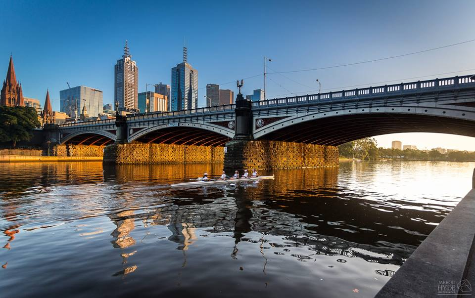
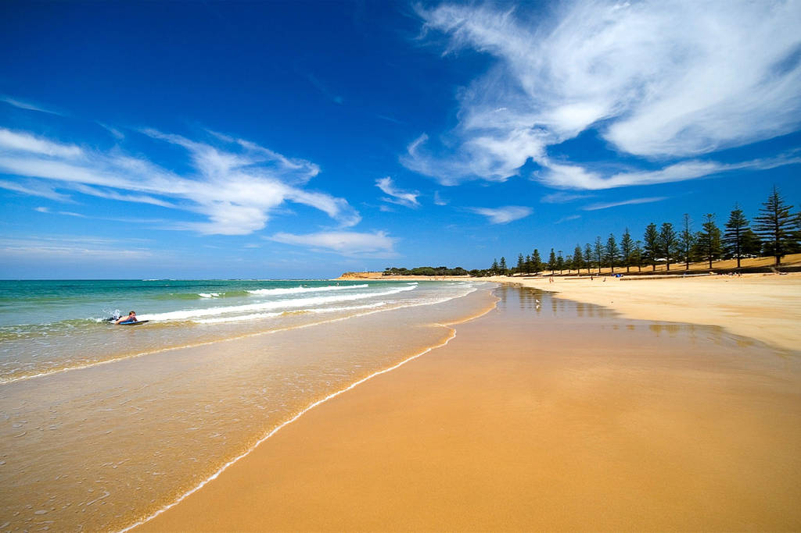

class: center, middle

```{r setup, include = FALSE}

options(htmltools.dir.version = FALSE)

```

# Who am I?

---
class: center, middle

``` {r introImage1, echo = FALSE}

# Australia
knitr::include_graphics("images/australia-map.jpg")

```

---
class: center, middle

``` {r introImage2, echo = FALSE}

# Melbourne


```

---
class: center, middle

``` {r introImage3, echo = FALSE}

# Torquay


```

---
class: center, middle

``` {r introImage4, echo = FALSE}

# Karate
# knitr::include_graphics("images/.jpg")

```

---
class: center, middle

``` {r introImage5, echo = FALSE}

# Aus --> NZ sketch
# knitr::include_graphics("images/.jpg")

```

---
class: center, middle

# The long and winding road...

---
class: center, middle

``` {r careerPathImage1, out.width = "800px", echo = FALSE}


```

---
class: center, middle

``` {r careerPathImage2, out.width = "800px", echo = FALSE}

knitr::include_graphics("images/careerpath2.png")

```

---
class: center, middle

``` {r careerPathImage3, out.width = "800px", echo = FALSE}

knitr::include_graphics("images/careerpath3.png")

```

---
class: center, middle

``` {r careerPathImage4, out.width = "800px", echo = FALSE}


```

---
class: center, middle

``` {r careerPathImage5, out.width = "800px", echo = FALSE}


```

---
class: center, middle

``` {r careerPathImage6, out.width = "800px", echo = FALSE}

knitr::include_graphics("images/careerpath6.png")

```

---
class: center, middle

# Helpful resources and links

---

## Data visualisation

---

## Programming (R, CSS)

[xaringan demo presentation](https://slides.yihui.name/xaringan/)

[xaringan wiki](https://github.com/yihui/xaringan/wiki)

---

## Image credit

[Map of Australia](https://backpackerlee.wordpress.com/2014/09/10/top-5-cities-to-backpack-in-australia)

[Jarrod Hyde - Rowers on the Yarra River, Melbourne](https://www.instagram.com/jarrodhydephotography/?hl=en)

[Torquay Front Beach](https://www.airbnb.com.au/rooms/14825546)